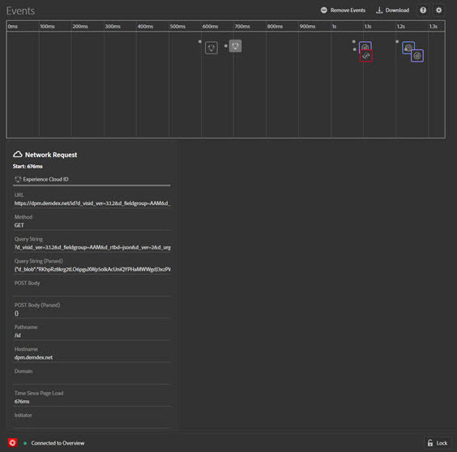

# Gebeurtenissen{#events}

>[!IMPORTANT]
>
>Adobe Experience Cloud Cloud Debugger 2.0 is momenteel in bèta. De documentatie en de functionaliteit kunnen worden gewijzigd.

Het scherm Gebeurtenissen geeft een grafische weergave van de gebeurtenissen die plaatsvinden en die op een tijdlijn worden weergegeven.

Voor elke gebeurtenis verschijnt er een pictogram voor de toepasselijke Experience Cloud-oplossing op de tijdlijn. De pictogrammen tonen ook veranderingen in de gegevenslaag (als toegelaten). Houd de muisaanwijzer boven een pictogram voor een overzicht van de gebeurtenis. Klik op de gebeurtenis voor meer informatie. U kunt meerdere gebeurtenissen weergeven door Shift of Control ingedrukt te houden en te klikken.

Klik op een detail voor meer informatie.

## Wijzigingen in gegevenslaag bijhouden

Wijzigingen in gegevenslagen bijhouden in de tijdlijn inschakelen:

1. Klik op het tandwielpictogram rechtsboven.
1. Voer de naam van de gegevenslaag in.

   

1. Klik op **[!UICONTROL Save]**.

De gegevens van de de veranderingsdetails van de gegevenslaag tonen om het even wat die is geschrapt of toegevoegd. U kunt klikken **{}** om dieper in de gegevenslaag te kijken.

## Gebeurtenisgegevens downloaden

Klik **[!UICONTROL Download]** om een dossier van Excel te downloaden dat informatie over uw paginavraag toont.